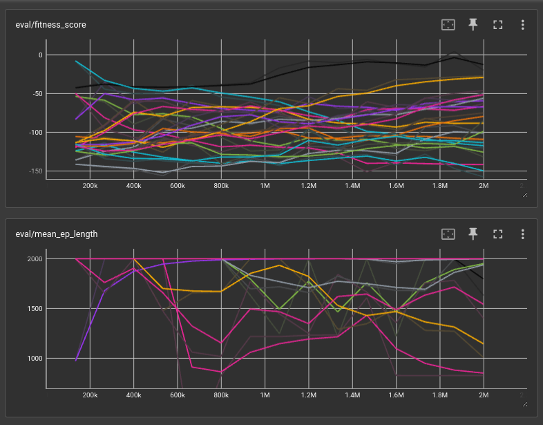
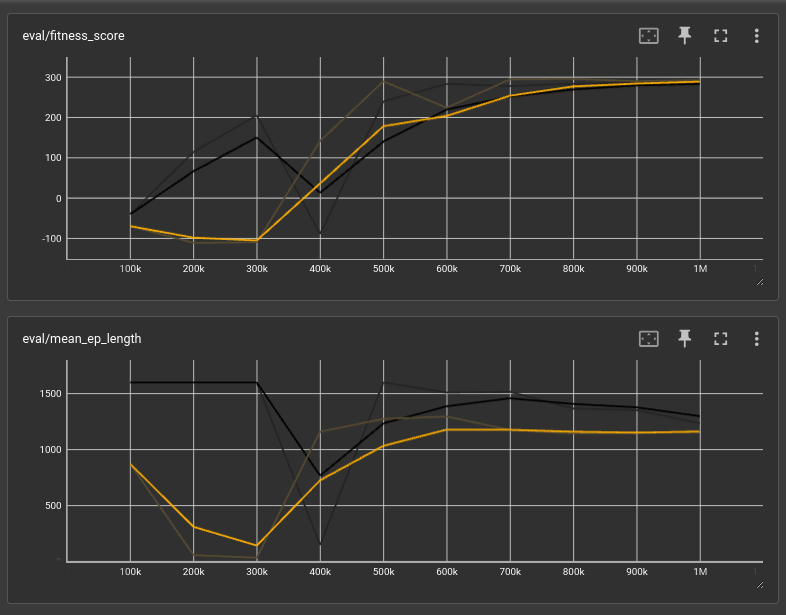
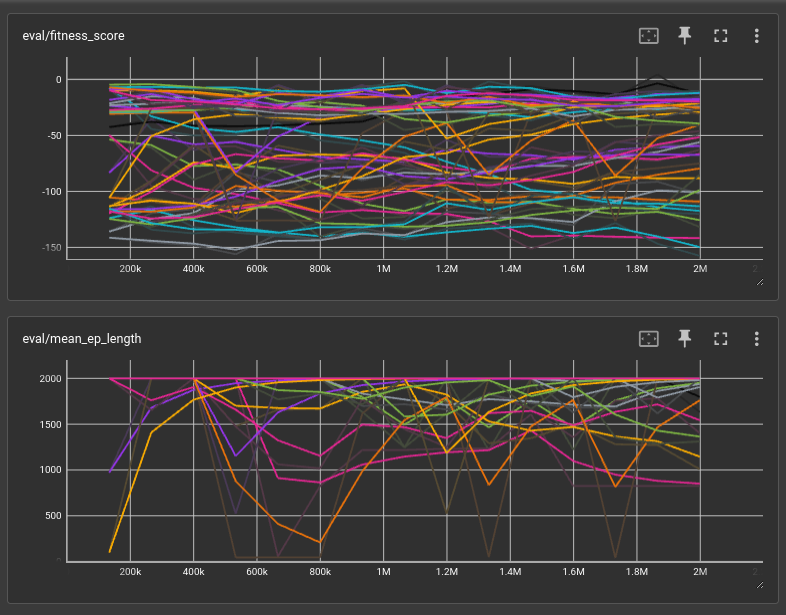
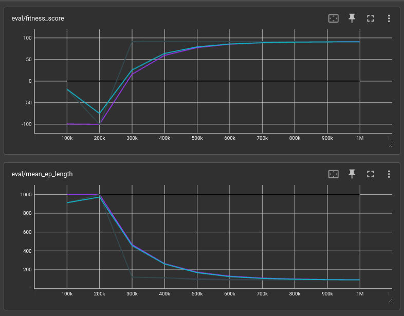
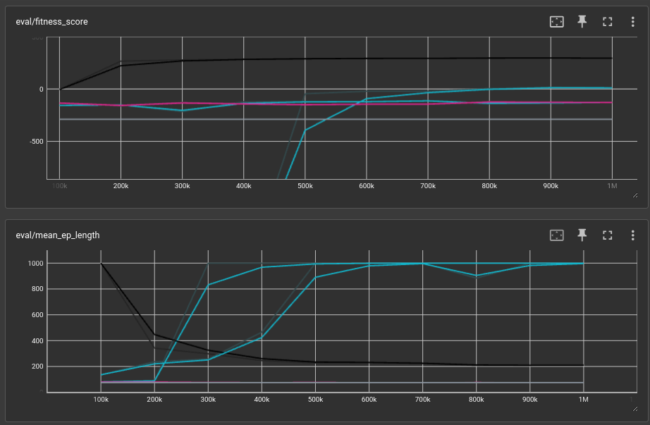

# Stable Eureka
Stable Eureka is an iterative and autonomous llm-based reward designer for reinforcement learning. It integrates
[stable-baselines3](https://stable-baselines3.readthedocs.io/en/master/), open-source LLMs (running locally with [ollama](https://www.ollama.com/)) and [gymnasium](https://gymnasium.farama.org/)-based environments. This repo is based on [NVIDIA Eureka](https://github.com/eureka-research/Eureka/tree/main).

You only need to provide the environment with a brief task description, model and algorithm hyperparameters and let `stable-eureka`
do the rest!

## Installation

```bash
git clone https://github.com/rsanchezmo/stable-eureka.git
cd stable-eureka
pip install .
```

You must install ollama before running the code:
```bash
curl -fsSL https://ollama.com/install.sh | sh
```

## Available LLMs
### Ollama
You have to pull the LLMs you want to use from the ollama repository. For example, to pull the llama3 LLM:
```bash
ollama pull llama3
```
- `llama3`: very fast model, not very accurate 7B
- `codestral`: too large for my gpu (`rtx4070 8gb` too slow)
- `codellama`: a bit slower than llama3
- `mistral`
- `phi3`
- `gemma`

If the model is too large to be run on gpu, it will use some of the available cpu cores. This will be much slower than running entirely on gpu.

### OpenAI
You can use OpenAI LLMs by providing an API key. It depends on the model you want to use, how much it will cost.
You must set the environment variable `OPENAI_API_KEY` with your key.


## Configuration
You must fill a configuration file with the following structure:
```yaml
eureka:
    backend: 'openai'  # 'ollama' or 'openai'
    model: 'gpt-4o'
    temperature: 1.0  # if this value is too low, it is almost deterministic
    iterations: 5
    samples: 8
    use_initial_reward_prompt: false  # if available, use the initial reward prompt
    pretraining_with_best_model: true  # use best model weights for pretraining the next models

environment:
    name: 'bipedal_walker'
    max_episode_steps: 1600
    class_name: 'BipedalWalker'
    kwargs: null
    benchmark: 'BipedalWalker-v3'  # if benchmark available, set it to train the agent with the same params

experiment:
    parent: 'experiments'
    name: 'bipedal_walker_gpt4o'
    use_datetime: true

rl:
    algo: 'ppo'
    algo_params:
        policy: 'MlpPolicy'
        learning_rate: 0.0003
        n_steps: 2048
        batch_size: 64
        n_epochs: 10
        gamma: 0.999
        gae_lambda: 0.95
        clip_range: 0.2
        ent_coef: 0.0
        vf_coef: 0.5
        max_grad_norm: 0.5

    architecture:
        net_arch: {'pi': [64, 64], 'vf': [64, 64]}
        activation_fn: 'ReLU'
        share_features_extractor: false

    training:
        seed: 0
        eval:
            seed: 5
            num_episodes: 2
            num_evals: 10
        total_timesteps: 1_000_000
        device: 'cuda'
        num_envs: 4
        state_stack: 1
        is_atari: false

    evaluation:
        seed: 10
        num_episodes: 10
        save_gif: true
```

## Environment
You must provide the env code in a `env.py` file for now. You should include take the step func into a `step.py` file, and must
create a `task_description.txt` file with the task description:

```
envs/
    bipedal_walker/
        env.py
        step.py
        task_description.txt
        initial_reward_prompt.txt
```

The code will copy the code into the experiments folder and append the reward function to it. The reward function should 
satisfy the signature:
```python
reward, individual_reward = self.compute_reward(param1, param2, param3)
```
By doing so, the code will be automatically executed by the experiment runner once the reward function is appended.

You must also implement the `self.compute_fitness_score`, the ground truth reward function that allows to compare between 
environments with different reward functions. You can see several implementations on the environments folder:
```python
fitness_score = self.compute_fitness_score(param1, param2, param3)
```

> [!NOTE] 
> The `compute_fitness_score` returns a part of the total fitness score, which is actually the sum over all the episode. 
> Same as reward is the sum of the intermediate rewards during the episode. If the total fitness score is a binary value such as 1 for success, 
> then you will provide always 0 until the episode ends where it will return a 1.

Finally, you must set in the individual_rewards dict the `fitness_score` value:
```python
individual_rewards.update({'fitness_score': fitness_score})
```
This allows us to save all this values for later reward reflection.

> [!TIP]
> You can add a `initial_reward_prompt.txt` with a reward prompt that will be used as the initial reward function (e.g. human-designed reward).

## Running the code
First insert the configuration `yaml` file on the `train.py` and then run the code with the following command:
```bash
python3 train.py
```

An example of the best model trained with the bipedal walker environment is shown below:


You will see several `txt` files, which are saved after every iteration during training, that contains the `reward reflection` and `reward proposal`. This
is very interesting to get the intuition on how the LLM is thinking. It is a measure of explainability of the reward.

### Reward reflection
```text
Reward reflection:
We trained a RL policy using the provided reward function code and tracked (on evaluation on several points of the training stage) the values of individual reward components, along with global policy metrics such as fitness scores and episode lengths. Maximum, mean, and minimum are provided:
   forward_reward: [13121.138454055786, 9341.189715862274, 9521.890161800384, 9400.695260047913, 10065.639485168456, 11724.97672328949, 10069.660636043549, 10740.681833457948, 12938.879294681548, 11215.40620317459, 8131.976818609238, 9734.652427577972, 6640.936949777603, 9521.58740568161, 9363.427110481261]. Max: 13121.138454055786 - Mean: 10102.182565313973 - Min: 6640.936949777603 
   falling_penalty: [-198.0, 0.0, 0.0, 0.0, 0.0, 0.0, 0.0, 0.0, 0.0, 0.0, 0.0, 0.0, 0.0, 0.0, 0.0]. Max: 0.0 - Mean: -13.2 - Min: -198.0 
   velocity_reward: [11.809694246131855, 0.04023022890840579, 0.5822156609740847, 0.2340783854696508, 2.271507745648967, 7.641467177138006, 2.286215534477952, 6.3488340009119435, 14.135732584091832, 8.902684970785419, -6.023745897157704, 0.6802330283854064, -18.745783407066277, -1.0316512879889508, -2.7389849074351544]. Max: 14.135732584091832 - Mean: 1.7595152042183633 - Min: -18.745783407066277 
   step_penalty: [-20.000000000000327, -20.000000000000327, -20.000000000000327, -20.000000000000327, -20.000000000000327, -20.000000000000327, -20.000000000000327, -20.000000000000327, -20.000000000000327, -20.000000000000327, -20.000000000000327, -20.000000000000327, -20.000000000000327, -20.000000000000327, -20.000000000000327]. Max: -20.000000000000327 - Mean: -20.000000000000334 - Min: -20.000000000000327 
   end_bonus: [0.0, 0.0, 0.0, 0.0, 0.0, 0.0, 0.0, 0.0, 0.0, 0.0, 0.0, 0.0, 0.0, 0.0, 0.0]. Max: 0.0 - Mean: 0.0 - Min: 0.0 
   fitness_score: [-7.640170059708379, -44.228325628632696, -49.997727331429445, -49.45782796676649, -39.163192663373174, -54.34482201423511, -58.696807279009235, -65.40708693606149, -83.79791035711598, -93.28890632806646, -110.10721325935819, -105.43695012318736, -112.70917742528646, -118.5043210912788, -119.79936829501749]. Max: -7.640170059708379 - Mean: -74.17198711723513 - Min: -119.79936829501749 
   reward: [12914.947832679749, 9321.229683208465, 9502.472014522553, 9380.92905216217, 10047.910804748535, 11712.618135166169, 10051.946789073943, 10727.030618858338, 12933.014808654785, 11204.308874893188, 8105.9528759121895, 9715.33242225647, 6602.191133832932, 9500.555618143082, 9340.688009309768]. Max: 12933.014808654785 - Mean: 10070.741911561488 - Min: 6602.191133832932 
   episode_length: [2000.0, 2000.0, 2000.0, 2000.0, 2000.0, 2000.0, 2000.0, 2000.0, 2000.0, 2000.0, 2000.0, 2000.0, 2000.0, 2000.0, 2000.0]. Max: 2000.0 - Mean: 2000.0 - Min: 2000.0 

Please analyze the policy feedback and provide an improved reward function to better solve the task. Tips for analyzing feedback:
1. If a reward component's values are nearly identical, or it increases when it should decrease (minimize) and vice versa, consider the following options:
    a. Change its scale or temperature parameter.
    b. Re-write the component.
    c. Discard the component.
2. If a component's magnitude is significantly larger, re-scale it.
3. You want to maximize the fitness score as it is the ground truth evaluator.
4. You want to maximize positive reward components values during training and minimize negative reward components values.
5. If the fitness score is not improving during training, try to change the reward function.
Analyze each existing reward component first, then write the new reward function code proposal.Stable-Eureka best iteration  (you should modify it!): 
    # Generated code by stable-eureka
    def compute_reward(self, pos, action, state):
        reward_components = {}
        
        # Reward for moving forward
        forward_reward = pos[0]
        reward_components['forward_reward'] = forward_reward
        
        # Penalty for falling down
        falling_penalty = -10.0 if self.hull.angle > 1.0 or self.hull.angle < -1.0 else 0.0
        reward_components['falling_penalty'] = falling_penalty
        
        # Reward for maintaining some velocity
        velocity_reward = state[2]
        reward_components['velocity_reward'] = velocity_reward
        
        # Penalty for taking too many steps (discouraging to not move)
        step_penalty = -0.01
        reward_components['step_penalty'] = step_penalty
        
        # Bonus for reaching the end
        end_bonus = 100.0 if pos[0] > (TERRAIN_LENGTH - TERRAIN_GRASS) * TERRAIN_STEP else 0.0
        reward_components['end_bonus'] = end_bonus
        
        # Total reward
        total_reward = (
            forward_reward + falling_penalty + 
            velocity_reward + step_penalty + end_bonus
        )
    
        return total_reward, reward_components
```
### Reward proposal
```text
An analysis of the policy feedback reveals several key insights:
1. **Forward Reward**: This component appears to be functioning correctly, as suggested by its relatively high and varied values. Need minor adjustments.
2. **Falling Penalty**: This component is almost always zero, suggesting that better differentiation may be needed to penalize the agent appropriately.
3. **Velocity Reward**: The values for this component are very low and some are even negative, suggesting either an incorrect formulation or incorrect scaling.
4. **Step Penalty**: This component remains constant and its value is relatively low, it may not be significant enough. It should be adjusted or rewritten.
5. **End Bonus**: Consistently zero, indicating that either the agent rarely reaches the end, or the condition for awarding this bonus is too stringent.

### New Reward Function Proposal

We need to adjust the reward function to better encourage desirable behaviors such as moving forward efficiently while avoiding falling and reaching the end.

    ```python
    def compute_reward(self, pos, action, state):
        reward_components = {}
        
        # Reward for moving forward
        forward_reward = pos[0]
        reward_components['forward_reward'] = forward_reward
        
        # Penalty for falling down
        falling_penalty = -20.0 if self.hull.angle > 0.5 or self.hull.angle < -0.5 else 0.0
        reward_components['falling_penalty'] = falling_penalty
        
        # Reward for maintaining some level of horizontal velocity, penalizing backward or stationary states
        velocity_reward = max(0.1 * np.abs(state[2]), 0)
        reward_components['velocity_reward'] = velocity_reward
    
        # Enhanced Penalty for excessive steps to prevent getting stuck
        step_penalty = -0.1
        reward_components['step_penalty'] = step_penalty
        
        # Bonus for reaching the end
        end_bonus = 200.0 if pos[0] > (TERRAIN_LENGTH - TERRAIN_GRASS) * TERRAIN_STEP else 0.0
        reward_components['end_bonus'] = end_bonus
        
        # Total reward
        total_reward = (
            forward_reward + falling_penalty + 
            velocity_reward + step_penalty + end_bonus
        )
    
        return total_reward, reward_components
    ```

### Explanation
1. **Forward Reward**: Slight modification not needed as it correctly incentivizes forward motion.
2. **Falling Penalty**: Increased penalty and adjusted angle threshold to better penalize falling.
3. **Velocity Reward**: Modified to reward only positive horizontal velocity to keep the agent moving forward.
4. **Step Penalty**: Enhanced step penalty to prevent the agent from taking excessive steps and getting stuck.
5. **End Bonus**: Increased the end bonus to provide a stronger incentive for reaching the goal.
```

## Logging
Once training, every experiment will be logged to tensorboard. Evaluation callbacks will record the `fitness_score` and the `episode_length`
so you can compare the performance of the agent with the ground truth reward function. Every other metric will be recorded internally thanks to `stable-baselines3`.

To run tensorboard, you can use the following command:
```bash
cd experiments/bipedal_walker_gpt4o/2024-06-06/code/
tensorboard --logdir .
```



As you will see, you will be able to display every experiment as well as the benchmark if available and you have set it in the configuration file.


## Results
In the following table, you can see results obtained on `gymnasium` environments against the same parameters but using the original reward (benchmark). 
You can find the hyperparameters used on these tests in the `configs` folder. Benchmark curve is shown in **black**. Recall that `fitness_score` is the ground truth reward function.

| Gymnasium Environment      | Stable Eureka | Benchmark | LLM used    | Reward                                                        |
|----------------------------|---------------|-----------|-------------|---------------------------------------------------------------|
| `BipedalWalker-v3`         | YES           | YES       | `gpt-4o`    |                    |
| `BipedalWalkerHardcore-v3` | NO            | NO        | `gpt-4o`    |  |
| `MountainCarContinuous-v0` | YES           | NO        | `llama3-8B` |  |
| `LunarLander-v2`           | YES           | YES       | `gpt-4o`    |                        |

## Contributors

**Rodrigo Sánchez Molina**
  - Email: rsanchezm98@gmail.com
  - Linkedin: [rsanchezm98](https://www.linkedin.com/in/rsanchezm98/)
  - Github: [rsanchezmo](https://github.com/rsanchezmo)

## Citation
If you find `stable-eureka` useful, please consider citing:

```bibtex
  @misc{2024stableeureka,
    title     = {Stable Eureka},
    author    = {Rodrigo Sánchez Molina},
    year      = {2024},
    howpublished = {https://github.com/rsanchezmo/stable-eureka}
  }
```